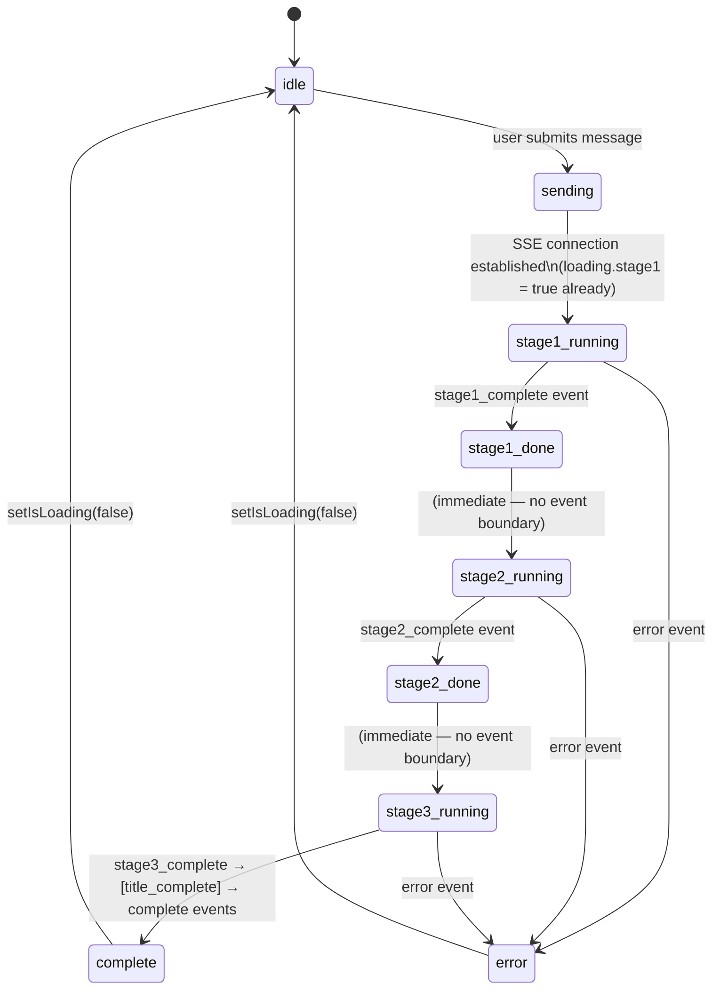

# VMM Rada — Query Processing Pipeline

This document traces the full lifecycle of a single user message through the VMM Rada
pipeline — from the HTTP request landing on the Go server to the final SSE `complete`
event being flushed to the browser. It is a code-anchored walkthrough; every step
references the function and file responsible for it.

Two pipeline strategies are implemented, selected by `CouncilType.Strategy`:

- **`PeerReview`** (default) — N council members independently answer, then anonymously
  rank each other, and a chairman synthesises the result. Three external-model stages.
- **`RoleBased` / `RoleBasedReview`** — M specialised roles run in parallel (Stage 1),
  Stage 2 is skipped, and a chairman synthesises all role outputs (Stage 3). Used by the
  `/review` endpoints for code review.

For the PeerReview pipeline: **N council members** (Stage 1 generators + Stage 2 peer
reviewers) and **1 chairman** (Stage 3 synthesiser).

---

## High-level pipeline

```
HTTP POST /api/conversations/{id}/message[/stream]
    │
    ▼
api.Handler.sendMessage / sendMessageStream      [internal/api/handler.go]
    │   1. validate UUID, body size, content XOR answers
    │   2. persist user message (round-1) OR load+update clarification round (round-N)
    │
    │   ┌─ Stage 0 (gated by CLARIFICATION_MAX_ROUNDS > 0) ──────────────────────────────┐
    │   │  3. council.RunClarificationRound(ctx, query, history, councilType, onEvent)       │
    │   │     └── emit stage0_round_complete → stream closes (awaiting client answers)       │
    │   │     OR  emit stage0_done → fall through to Stage 1                                 │
    │   └─────────────────────────────────────────────────────────────────────────────────  ─┘
    │
    │   4. call council.RunFullWithClarifications(ctx, query, history, councilType, onEvent)
    │      (builds augmented prompt internally; delegates to RunFull)
    ▼
council.Council.RunFull                          [internal/council/runner.go]
    │
    ├── Stage 1: runStage1   (parallel fan-out, N goroutines)
    │     │
    │     └── checkQuorum     [internal/council/council.go]
    │     └── assignLabels    [internal/council/council.go]
    │     └── emit stage1_complete
    │
    ├── Stage 2: runStage2   (parallel fan-out, k goroutines, k = quorum survivors)
    │     │
    │     └── CalculateAggregateRankings  [internal/council/rankings.go]
    │     └── emit stage2_complete + metadata
    │
    └── Stage 3: runStage3   (single chairman call)
          └── emit stage3_complete
    │
    ▼
api.Handler:
    5. persist assistant message
    6. spawn title goroutine; select on 30s deadline
    7. emit title_complete (if title generated in time)
    8. emit complete
```

---

## 0. Stage 0: Clarification

**Files:** `internal/council/runner.go`, `internal/council/council.go`, `internal/storage/storage.go`

Stage 0 is config-gated: only runs when `CLARIFICATION_MAX_ROUNDS > 0`. When disabled (default), execution jumps directly to Section 1 below.

### Generator phase

All council generators run in parallel (same fan-out pattern as Stage 1). Each receives `BuildStage0GeneratorPrompt(query, history)` and must return strict JSON:

```json
{"questions": [{"text": "What database are you currently using?"}]}
```

Malformed JSON from a generator → that generator contributes 0 questions (does not stall the wait group). Quorum check applies: fewer than M_min successful responses → `503`.

### Chairman phase

All candidate questions are collected and passed to `BuildStage0ChairmanPrompt(...)`. The chairman uses `ResponseFormat: json_object` and must return:

```json
{"questions": [{"id": "q1", "text": "..."}], "enough": bool}
```

Chairman trims to `CLARIFICATION_MAX_QUESTIONS_PER_ROUND`. Malformed JSON → fail-open (WARN log + treat as `enough: true`).

### Termination paths (all emit `stage0_done`, then Stage 1 proceeds)

| Condition | When checked |
|-----------|--------------|
| `CLARIFICATION_MAX_ROUNDS == 0` | Feature entry |
| `round > MAX_ROUNDS` | Top of each round |
| Accumulated questions ≥ `MAX_TOTAL_QUESTIONS` | Top of each round |
| User submitted all-empty answers (round > 1) | Top of each round |
| Chairman returns `enough: true` | After chairman call |
| Chairman returns zero questions | After chairman call |
| Chairman JSON malformed | Fail-open: WARN log, then `stage0_done` |

### Augmented query

`RunFullWithClarifications` calls `BuildAugmentedQuery(originalQuery, history)` internally before passing to `RunFull`:

```
Original question: Should I migrate to Postgres?

## User clarifications
Q: What database are you currently using and at what scale?
A: MySQL 5.7, ~2k writes/sec

Q: What is prompting this migration?
A: Need JSONB and better full-text search
```

Stage 1/2/3 prompts are unchanged — they receive the augmented string as `query`.

---

## 1. HTTP entry and request validation

**File:** `internal/api/handler.go`

For both endpoints (`POST /api/conversations/{id}/message` and
`POST /api/conversations/{id}/message/stream`):

1. **CORS preflight** — `OPTIONS` requests return `204` with CORS headers; otherwise
   fall through to the main handler.
2. **Security headers** — `X-Content-Type-Options: nosniff`, `X-Frame-Options: DENY`,
   `Content-Security-Policy: default-src 'none'` are written on every response.
3. **Body size limit** — `http.MaxBytesReader(w, r.Body, 1<<20)` caps the request body
   at 1 MiB before `json.NewDecoder(r.Body).Decode(&req)`.
4. **Path parameter validation** — `{id}` is matched against the UUID v4 regex
   `^[0-9a-f]{8}-...-4...-[89ab]...$` before any storage call. Mismatch → `400`.
5. **Body decoding** — request shape (current):
   ```json
   { "content": "...", "council_type": "default" }
   ```
   Planned (issue #154): XOR — `content` for round-1, `answers:[{id,text}]` for round-N.
   `council_type` defaults to the `DEFAULT_COUNCIL_TYPE` env var if missing/empty.
6. **Content non-empty check** — empty `content` → `400`.
7. **Conversation lookup** — `store.Get(id)` returns `*Conversation` or `ErrNotFound`
   (→ `404`).
8. **Persist user message** — `store.AppendMessage` serialises
   `{"role":"user","content":"..."}` into `messages`.

---

## 2. SSE handshake (streaming endpoint only)

**File:** `internal/api/handler.go` — `sendMessageStream`

1. Set headers: `Content-Type: text/event-stream`, `Cache-Control: no-cache`,
   `X-Accel-Buffering: no`. Flush them so the client sees `200 OK` immediately.
2. Type-assert `w.(http.Flusher)`; bail with `500` if the writer doesn't support flushing.
3. Build an `EventFunc` closure that:
   - JSON-encodes the event,
   - writes `data: <payload>\n\n` to the response writer,
   - calls `flusher.Flush()` after each event.
4. Pass the closure into `council.RunFull(ctx, query, councilType, onEvent)`.

The non-streaming endpoint instead **collects** stage results in memory (passes an
`onEvent` that captures into a struct) and writes them as a single JSON response on
return.

---

## 3. Council.RunFull — orchestration

**File:** `internal/council/runner.go`

```go
func (c *Council) RunFull(ctx context.Context, query string, councilTypeName string, onEvent EventFunc) error
```

1. **Resolve council type** — `c.registry[councilTypeName]` → `CouncilType{Models, ChairmanModel, Temperature, QuorumMin}`. Unknown name → return error (handler maps to `500`).
2. **Allocate result slot per model** — `stage1 := make([]*StageOneResult, len(ct.Models))`. The slot index = the model's index in `ct.Models`; this avoids any locking inside the goroutines.
3. Sequentially call `runStage1`, `runStage2`, `runStage3`, emitting events between stages.
4. Any error from a stage is wrapped with `fmt.Errorf("stage X: %w", err)` and propagated. `EventFunc` is **not** invoked on error — the handler is responsible for emitting an `error` SSE event from the returned error.

---

## 4. Stage 1 — parallel generation

**File:** `internal/council/runner.go` — `runStage1`
**Prompt:** `internal/council/prompts.go` — `BuildStage1Prompt`

### 4.1 Prompt construction

`BuildStage1Prompt(query string)` is a trivial pass-through:

```
[ { "role": "user", "content": <query verbatim> } ]
```

No system prompt, no preamble — the model decides format.

### 4.2 Fan-out

For each `(idx, model)` in `ct.Models`:

```go
go func(idx int, model string) {
    defer wg.Done()
    start := time.Now()
    req := council.CompletionRequest{
        Model:       model,
        Messages:    BuildStage1Prompt(query),
        Temperature: ct.Temperature,
    }
    resp, err := c.llm.Complete(ctx, req)
    if err != nil { results[i] = StageOneResult{Error: err}; return }
    results[i] = StageOneResult{
        Content:    resp.Content,
        Model:      model,
        DurationMS: time.Since(start).Milliseconds(),
    }
}(i, model)
```

`sync.WaitGroup` joins all goroutines; **no mutex** — each goroutine writes to its own
pre-allocated `[]StageOneResult` slot (value type, not pointer).

### 4.3 Quorum check

**File:** `internal/council/council.go` — `checkQuorum`

- Count non-nil entries: `successes`.
- Required: `ct.QuorumMin` if `> 0`, otherwise `max(2, (N+1)/2 + 1)` (majority + 1,
  never less than 2).
- If `successes < required` → return `*QuorumError{Got: N, Need: N}`. Handler maps
  this to **HTTP 503** (or an `error` SSE event on the streaming path).

### 4.4 Label assignment

**File:** `internal/council/council.go` — `assignLabels`

Assigns anonymous labels (`Response A`, `Response B`, …) so peer reviewers cannot
identify each other:

```go
perm := rand.Perm(len(models)) // per-request random permutation
for i, idx := range perm {
    label := fmt.Sprintf("Response %c", rune('A'+i))
    labelToModel[label] = models[idx]
    modelToLabel[models[idx]] = label
}
```

The mapping is **per request** — not deterministic, not stable across runs. It is also
captured into `metadata.label_to_model` so the frontend can de-anonymise in Stage 2's UI.

### 4.5 Emit `stage1_complete`

```json
{
  "type": "stage1_complete",
  "data": [ { "label": "Response A", "content": "...", "model": "...", "duration_ms": 1240 }, ... ]
}
```

Nil entries (failed Stage 1 calls) are filtered out before emission.

---

## 5. Stage 2 — anonymous peer review

**File:** `internal/council/runner.go` — `runStage2`
**Prompt:** `internal/council/prompts.go` — `BuildStage2Prompt`

### 5.1 Prompt construction

`BuildStage2Prompt(query string, labeledResponses map[string]string)` — `labeledResponses`
maps anonymous label → response text. Labels are sorted internally for a deterministic
prompt order.

```
You are reviewing answers to the following question:

<query>

Below are <k> candidate answers, each labelled.

## Response A
<content>

## Response B
<content>
...

Rank the answers from best to worst. Respond ONLY with JSON of the form:
{"rankings": ["Response X", "Response Y", ...]}
```

JSON mode is requested via `response_format: {"type": "json_object"}` so OpenRouter
(and providers that honour it) return parseable JSON.

### 5.2 Fan-out

Each surviving Stage 1 model becomes a reviewer. K goroutines run in parallel; each
writes to its own slot in `stage2 := make([]*StageTwoResult, k)`. Each reviewer sees
its own response among the candidates — anonymity prevents identification, but the
response is still present.

### 5.3 Per-reviewer parsing

Each reviewer returns a JSON string. The runner:

1. `json.Unmarshal` into `struct{ Rankings []string }{}`.
2. **Parse failure** → log warning, leave slot `nil`. The reviewer is dropped; the
   pipeline continues with k − 1 rankings.
3. **Unknown labels** (typos, hallucinated `Response Z`) are kept as-is in the payload;
   `CalculateAggregateRankings` ignores them in score computation.
4. **Partial rankings** (fewer labels than presented) are accepted; missing labels
   receive a midrank in the next step.

### 5.4 Aggregate rankings + Kendall's W

**File:** `internal/council/rankings.go` — `CalculateAggregateRankings`

#### 5.4.1 Per-judge rank vectors with midrank imputation

For each judge j and each label `L_i`:
- If `L_i` appears at 0-indexed position p in `j.Rankings`: `R_j(L_i) = p + 1`
- If `L_i` is absent: assign **midrank** `R_j(L_i) = (n+1)/2`

The midrank is the expected average rank under uniform tie-breaking — absent labels
neither benefit nor suffer a penalty.

#### 5.4.2 Aggregate score per model

```
score(L_i) = (1/k) · Σ_j R_j(L_i)
```

`aggregate_rankings` is sorted **ascending** by score (lower = better rank). Each entry
maps the underlying model id (via `label_to_model`) to its score.

#### 5.4.3 Kendall's W (consensus coefficient)

Kendall's coefficient of concordance W measures inter-rater agreement:

```
R̄  = k · (n+1) / 2                     ← expected mean rank sum per item

S  = Σ_i ( Σ_j R_j(L_i) − R̄ )²        ← sum of squared deviations

W  = 12·S / ( k² · (n³ − n) )
```

Edge cases:
- `n == 1` → denominator is zero → return `W = 1.0` (trivial agreement).
- Floating-point drift → result clamped to `[0, 1]`.

`W ∈ [0, 1]`: 0 = no agreement, 1 = perfect agreement. Surfaced as `metadata.consensus_w`.

### 5.5 Emit `stage2_complete`

```json
{
  "type": "stage2_complete",
  "data": [ { "reviewer_label": "Response B", "rankings": ["Response A", "Response C", "Response B"] }, ... ],
  "metadata": {
    "council_type": "default",
    "label_to_model": { "Response A": "openai/gpt-4o-mini", ... },
    "aggregate_rankings": [ { "model": "openai/gpt-4o-mini", "score": 1.5 }, ... ],
    "consensus_w": 0.83
  }
}
```

`metadata` is a **top-level field** on the event object, not nested inside `data`.

---

## 6. Stage 3 — chairman synthesis

**File:** `internal/council/runner.go` — `runStage3`
**Prompt:** `internal/council/prompts.go` — `BuildStage3Prompt`

### 6.1 Consensus-tiered guidance

The chairman receives different instructions depending on `consensus_w`:

| `consensus_w` | Tier | Guidance |
|---------------|------|----------|
| `≥ 0.70` | strong | Synthesise the top-ranked answer; mention dissent only if it materially changes the conclusion. |
| `≥ 0.40` | moderate | Synthesise the top-ranked answer but acknowledge meaningful disagreement. |
| `< 0.40` | dissent | Surface well-reasoned minority views and present trade-offs rather than a single winner. |

### 6.2 Prompt body

The chairman receives:

1. The original user query.
2. All k Stage 1 responses with **labels and model ids visible** (the chairman is not
   anonymised — it sees who said what).
3. The aggregate ranking table — **structured rankings only**:
   ```
   Aggregate ranking (lower score = better):
   1. openai/gpt-4o-mini — score 1.5
   2. anthropic/claude-haiku-4-5 — score 2.5
   ```
   Reviewer prose (justifications) is **intentionally excluded** as a prompt-injection
   guard — a malicious council member cannot embed instructions that reach the chairman.
4. Consensus tier guidance (§6.1).
5. A directive to produce the final answer in markdown, addressed to the user.

### 6.3 Single LLM call

```go
req := council.CompletionRequest{
    Model:    ct.ChairmanModel,
    Messages: BuildStage3Prompt(query, stage1, aggregateRankings, consensusW),
    Temperature: ct.Temperature,
}
resp, err := c.llm.Complete(ctx, req)
```

On error: return wrapped error → handler emits `error` SSE event → stream ends.

### 6.4 Emit `stage3_complete`

```json
{
  "type": "stage3_complete",
  "data": { "content": "...", "model": "openai/gpt-4o-mini", "duration_ms": 1100 }
}
```

---

## 7. Persistence and title generation

**File:** `internal/api/handler.go` — `sendMessageStream`

After `RunFull` returns successfully:

1. **Persist assistant message** — append to `messages`:
   ```json
   { "role": "assistant", "stage1": [...], "stage2": [...], "stage3": {...}, "metadata": {...} }
   ```
   Written atomically: `{id}.json.tmp` → `os.Rename` → `{id}.json`, under
   `Store.mu.Lock()`.

2. **Spawn title goroutine** (only if title is still `"New Conversation"`):
   ```go
   titleCh := make(chan string, 1)
   go func() { titleCh <- deriveTitle(stage3.Content) }()
   ```
   `deriveTitle` truncates to the first **50 bytes** of the Stage 3 response (may cut
   mid-character on multi-byte UTF-8).

3. **Wait with 30-second deadline**:
   ```go
   select {
   case title := <-titleCh:
       store.SaveTitle(id, title)
       onEvent("title_complete", ...)
   case <-time.After(30 * time.Second):
       // title_complete NOT emitted; conversation title unchanged
   }
   ```
   This `select` is synchronous — `complete` is blocked until it resolves. Therefore
   `title_complete` (when emitted) **always precedes** `complete`.

4. **Emit `complete`**:
   ```json
   { "type": "complete" }
   ```

### Streaming vs non-streaming title difference

| Endpoint | Truncation |
|----------|-----------|
| `POST /message` | First 50 **runes** (`utf8.RuneCountInString`) |
| `POST /message/stream` | First 50 **bytes** — may cut mid-character |

---

## 8. Error handling and stream termination

An error at any stage causes the handler to:

1. Emit an `error` SSE event:
   ```json
   { "type": "error", "message": "stage 1: quorum not met (got 1, need 2 of 3)" }
   ```
2. Flush and terminate the stream — **no `complete` event follows**.
3. Leave the user message persisted; the assistant message is **not** persisted.

`*QuorumError` is surfaced as `503` on the non-streaming endpoint; on the streaming
endpoint the status is already `200` (headers flushed), so the error is conveyed only
in the SSE payload.

---

## 9. Critical invariants

- **No mutex inside Stage 1/2 goroutines** — pre-allocated slots, one goroutine per index.
- **Quorum applies only to Stage 1** — Stage 2 reviewers can fail individually without
  aborting the pipeline.
- **Labels are per-request and randomly shuffled** — reviewers cannot track identities
  across requests.
- **Reviewer prose never reaches the chairman** — structured rankings only, preventing
  prompt injection via a compromised council member.
- **`title_complete` always precedes `complete`** — guaranteed by the blocking `select`
  in the handler before emitting `complete`.
- **Atomic file writes** — `os.Rename` on the same filesystem; no partial-write
  corruption possible.

---

## 10. Frontend state transitions

The frontend (`frontend/src/App.jsx`) maintains a state machine driven entirely by the
SSE events emitted by the pipeline above.

### States

| State | Description |
|-------|-------------|
| `idle` | No message in flight; input enabled |
| `sending` | User message added to UI; assistant placeholder created; SSE connection open |
| `stage1_running` | Council models generating answers in parallel |
| `stage1_done` | All Stage 1 results received; peer-review beginning |
| `stage2_running` | All models peer-reviewing concurrently |
| `stage2_done` | Rankings and Kendall's W computed |
| `stage3_running` | Chairman model synthesising final answer |
| `complete` | All stages done; input re-enabled |
| `error` | Pipeline failed at any stage; input re-enabled |

### State diagram



### SSE event → state transition map

| SSE event | Frontend handler | State after |
|-----------|-----------------|-------------|
| *(connection open)* | assistant placeholder added; `loading.stage1=true` | `stage1_running` |
| `stage1_complete` | `msg.stage1 = data`; `loading.stage1 = false` | `stage1_done` / `stage2_running` |
| `stage2_complete` | `msg.stage2 = data`; `msg.metadata = metadata`; `loading.stage2 = false` | `stage2_done` / `stage3_running` |
| `stage3_complete` | `msg.stage3 = data`; `loading.stage3 = false` | `stage3_running` → done |
| `title_complete` | `loadConversations()` (sidebar refresh) | *(no stage change)* |
| `complete` | `loadConversations()`; `setIsLoading(false)` | `complete` → `idle` |
| `error` | `msg.error = message`; all `loading.*` → `false`; `setIsLoading(false)` | `error` → `idle` |

The backend emits **only `*_complete` events** — there are no `*_start` events over the wire.
`App.jsx` has handler entries for `stage2_start` and `stage3_start` but they are never
received; `loading.stage2` and `loading.stage3` are therefore always `false` in practice.

### Frontend loading flags

The assistant message carries three boolean flags that drive UI rendering:

```js
loading: {
  stage1: true,   // pre-initialised to true — spinner shows immediately on message send
  stage2: false,
  stage3: false,
}
```

`loading.stage1` starts as `true` when the assistant message is first created (before any
SSE events) so the Stage 1 spinner renders immediately. The backend does not emit a
`stage1_start` event — without this pre-initialisation the UI would appear frozen during
the several seconds while council models are running.

| Flag | `true` | `false` (with data) | `false` (no data) |
|------|--------|--------------------|--------------------|
| `loading.stage1` | Stage 1 spinner | Stage 1 accordion with model count | Stage 1 hidden |
| `loading.stage2` | *(never set to true in practice)* | Stage 2 rankings + consensus badge | Stage 2 hidden |
| `loading.stage3` | *(never set to true in practice)* | Stage 3 hero card | Stage 3 hidden |

### Assistant message shape at each state

```js
// sending — just created, before any SSE event
{ role:'assistant', stage1:null, stage2:null, stage3:null, metadata:null,
  loading:{stage1:true, stage2:false, stage3:false}, error:null }

// stage1_done — after stage1_complete
{ stage1:[{label,content,model,duration_ms},…],
  loading:{stage1:false, stage2:false, stage3:false} }

// stage2_done — after stage2_complete
{ stage1:[…], stage2:[{reviewer_label,rankings},…],
  metadata:{council_type,label_to_model,aggregate_rankings,consensus_w},
  loading:{stage1:false, stage2:false, stage3:false} }

// complete — after stage3_complete
{ stage1:[…], stage2:[…], stage3:{content,model,duration_ms},
  metadata:{…}, loading:{stage1:false,stage2:false,stage3:false}, error:null }

// error — at any stage
{ stage1:null|[…], stage2:null|[…], stage3:null, metadata:null|{…},
  loading:{stage1:false,stage2:false,stage3:false},
  error:"human-readable message" }
```

---

---

## RoleBased pipeline (RoleBased / RoleBasedReview)

**File:** `internal/council/rolebased.go` — `runRoleBased`

`RunFull` dispatches to `runRoleBased` when `ct.Strategy == RoleBased || RoleBasedReview`.

### High-level flow

```
POST /api/conversations/{id}/review[/stream]
    │
    ▼
api.Handler.sendReview / sendReviewStream        [internal/api/handler.go]
    │   1. validate UUID, body size, content non-empty
    │   2. persist user message
    │
    ▼
council.Council.RunFull("code-review")            [internal/council/runner.go]
    │   resolves ct = NewCodeReviewCouncilType(...)
    │   dispatches to runRoleBased
    │
    ▼
council.runRoleBased                              [internal/council/rolebased.go]
    │
    ├── Stage 1: runRoleBasedStage1 (parallel, M goroutines — one per role)
    │     │
    │     └── checkQuorum(stage1, ct.QuorumMin)  — all M roles required
    │     └── emit stage1_complete  (labels = role names, not A/B/C)
    │
    ├── Stage 2: skipped
    │     └── emit stage2_complete  (data=[], ConsensusW=1.0, AggregateRankings=[])
    │
    └── Stage 3: runRoleBasedStage3 (single chairman call)
          └── emit stage3_complete
    │
    ▼
api.Handler:
    3. persist assistant message
    4. spawn title goroutine; select on 30s deadline
    5. emit title_complete (if title generated in time)
    6. emit complete
```

### Stage 1 — parallel role execution

**File:** `internal/council/rolebased.go` — `runRoleBasedStage1`
**Prompt:** `internal/council/prompts.go` — `BuildRoleStage1Prompt`

Each `Role` in `ct.Roles` maps to one goroutine. Model assignment:

```go
model := ct.Models[idx % len(ct.Models)]
```

One model handles all roles; 4 models give one per role; any count wraps round-robin.

`BuildRoleStage1Prompt(role Role, query string)` returns:

```
[ { "role": "system", "content": role.Instruction },
  { "role": "user",   "content": query } ]
```

The `StageOneResult.Label` is set to the role's `Name` (`"security"`, `"logic"`, etc.),
not an anonymous `Response X` label.

**Quorum:** `checkQuorum(results, ct.QuorumMin)` with `QuorumMin = len(DefaultReviewRoles)` (4 for
`code-review`). Every role must succeed — unlike `PeerReview` where partial success is
allowed, each role covers a unique concern and a missing role silently drops coverage.

### Stage 2 — skipped

The `RoleBased` pipeline has no peer-ranking step: roles are complementary, not
competing, so ranking is semantically meaningless. A minimal `stage2_complete` event is
emitted to keep SSE clients compatible:

```go
Metadata{
    CouncilType:       ct.Name,
    LabelToModel:      labelToModel,    // role name → model
    AggregateRankings: []RankedModel{}, // empty — not applicable
    ConsensusW:        1.0,             // placeholder
}
```

`Stage2CompleteData.Results` is an empty slice (serialises as `[]` in the JSON `data` field) — never `null` — so SSE clients can safely iterate without a nil check.

### Stage 3 — chairman synthesis

**File:** `internal/council/rolebased.go` — `runRoleBasedStage3`
**Prompt:** `internal/council/prompts.go` — `BuildRoleChairmanPrompt`

`BuildRoleChairmanPrompt(query string, results []StageOneResult)` formats each role's
output into a labelled section:

```
The following is a code review of the provided code diff.
Each section is the output of a specialised reviewer role.

## security
<content>

## logic
<content>
...

Based on all reviewer findings above, produce a consolidated code review.
```

---

## File reference index

| File | Key symbols |
|------|------------|
| `internal/api/handler.go` | `sendMessage`, `sendMessageStream`, `sendReview`, `sendReviewStream` |
| `internal/council/runner.go` | `Council.RunFull`, `runStage1`, `runStage2`, `runStage3` |
| `internal/council/rolebased.go` | `runRoleBased`, `runRoleBasedStage1`, `runRoleBasedStage3` |
| `internal/council/review_roles.go` | `DefaultReviewRoles`, `NewCodeReviewCouncilType` |
| `internal/council/council.go` | `checkQuorum`, `assignLabels`, `QuorumError` |
| `internal/council/rankings.go` | `CalculateAggregateRankings` |
| `internal/council/prompts.go` | `BuildStage1Prompt`, `BuildStage2Prompt`, `BuildStage3Prompt`, `BuildRoleStage1Prompt`, `BuildRoleChairmanPrompt` |
| `internal/council/types.go` | `CouncilType`, `Strategy`, `Role`, `StageOneResult`, `StageTwoResult`, `StageThreeResult`, `Metadata`, `EventFunc` |
| `internal/openrouter/client.go` | `Client.Complete` |
| `internal/storage/storage.go` | `Store.Get`, `AppendMessage`, `SaveTitle` |
| `frontend/src/api.js` | `sendMessageStream` |
| `frontend/src/App.jsx` | `sseHandlers` |
